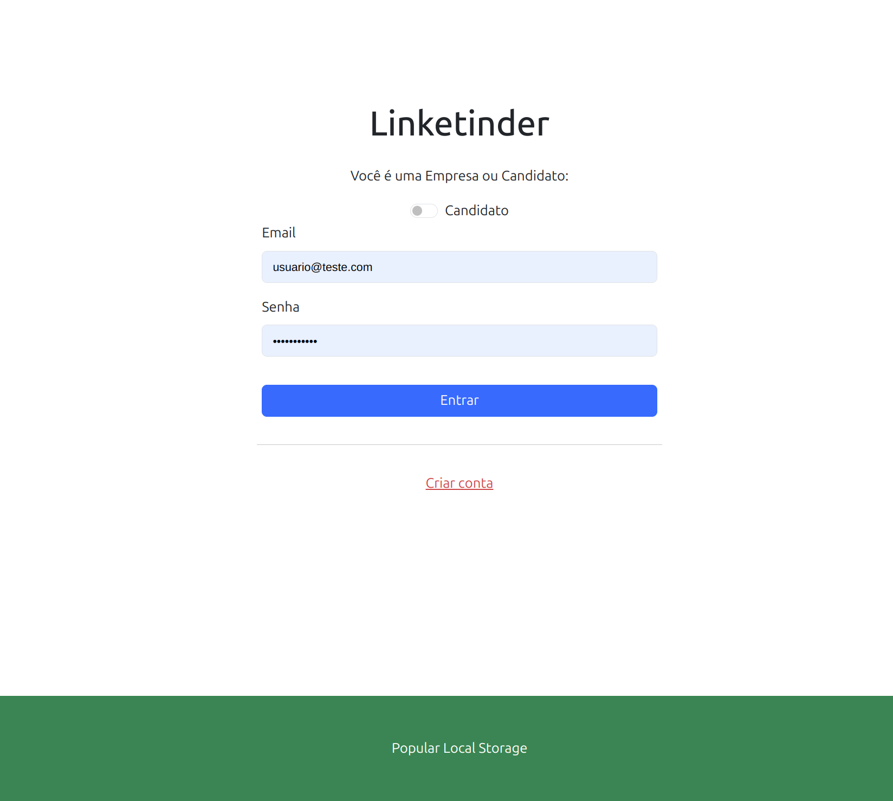
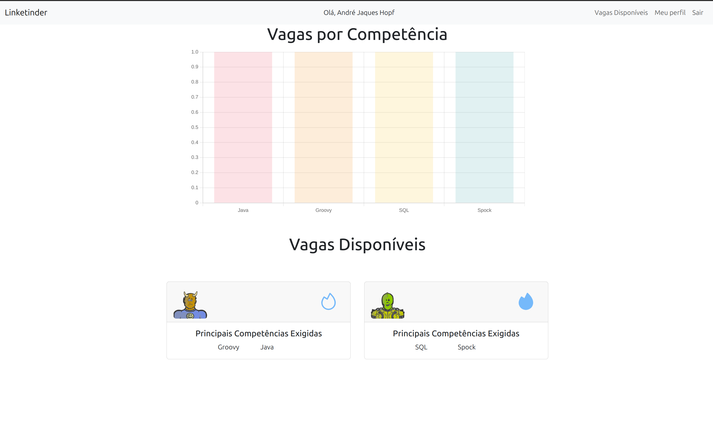
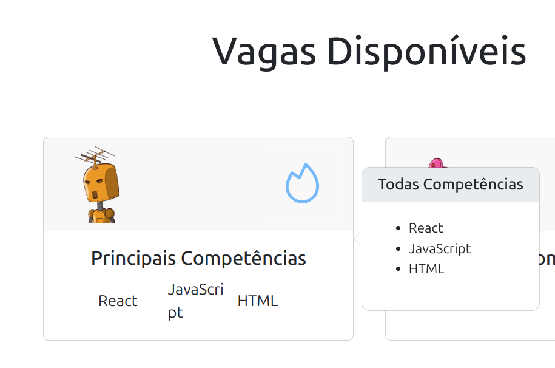
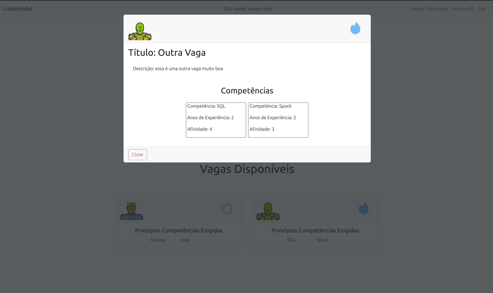
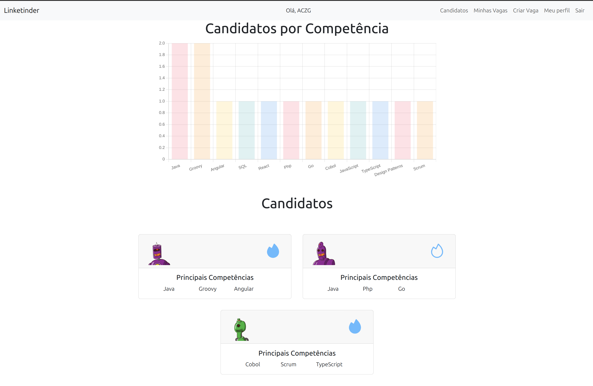
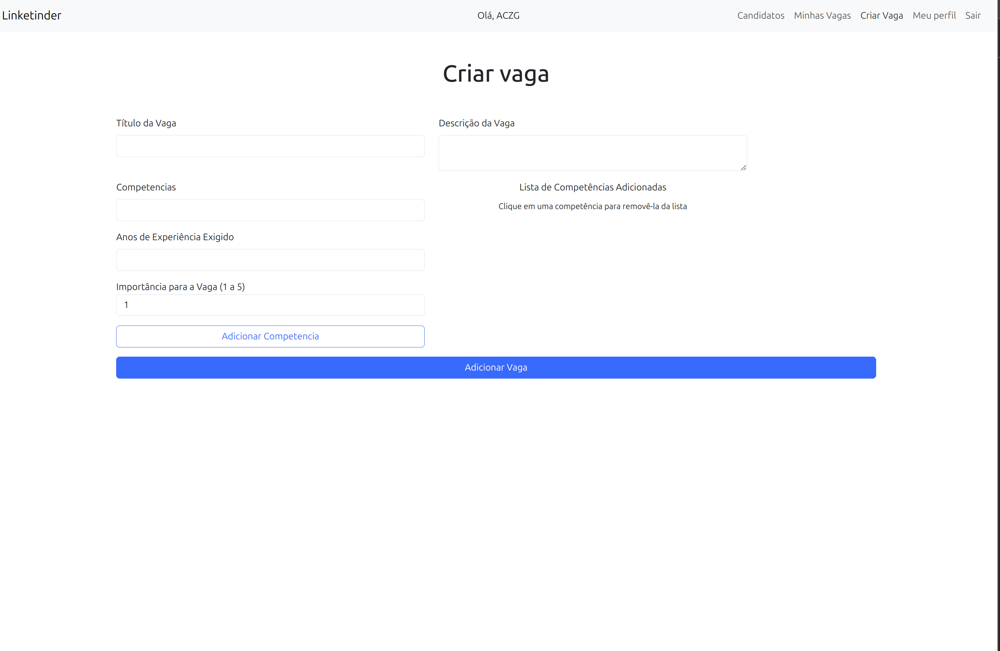
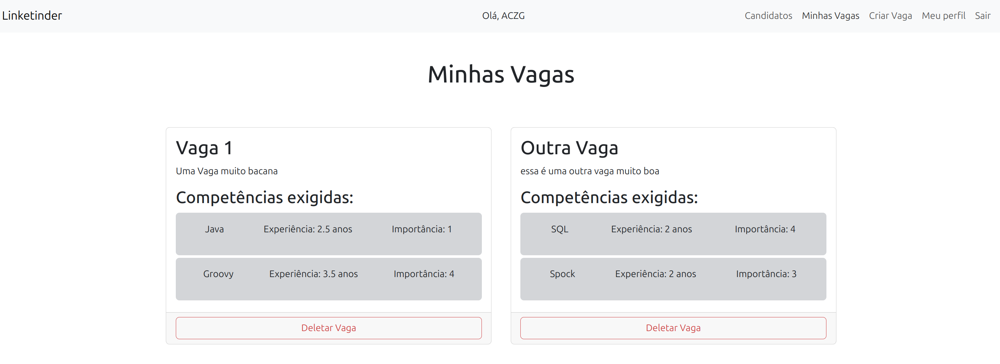

# Linketinder | Front-end

# Atenção!

Credenciais para login com usuario teste após utilizar a função "popular local storage":

email: usuario@teste.com
senha: Usuario@123

## Introdução
Este projeto é a primeira versão do Linketinder, um projeto audacioso que visa facilitar a contratação de talentos por empresas. A aplicação consiste em uma mistura de Linkedin com Tinder, onde teremos candidatos em empresas em busca de um match perfeito.

Na versão final da aplicação, os candidatos e empresas poderão visualizar uma lista de potenciais matches de acordo com as suas competências / necessidades.

Esta aplicação visa reduzir a possibilidade de viés por parte dos contrantes e contratados e trazer uma visão estritamente técnica da possível compatibilidade de competências.

Neste momento ainda estamos em fase inicial da construção do aplicativo, portanto ainda dependemos da interação com o terminal para a visualização e inserção de novos cadastros.

## Executando o Sistema

Você poderá visualizar o sitema em funcionamento no link: https://linketinder-front.vercel.app/

Se você deseja executar o sistema diretamente em sua máquina faça o clone deste repositório, instale as dependências com o comando 'npm install' e execute o sistema com o comando 'npm start'.

### Populando o Local Storage e utilizando o login padrão

Na tela inicial, onde é possível fazer o login no sistema, existe um botão verde no final da tela que, ao ser clicado, irá instanciar 10 empresas, 10 candidatos e 13 vagas.
Com isso ao entrar no sistema será possível visualizar o sistema com algumas informações já existentes.

Após clicar no botão, para fazer o login tanto como empresa como candidato utilize as seguintes credenciais:

email: usuario@teste.com
senha: Usuario@123

    

## Entendendo o Sistema

Atenção! A edição dos perfis ainda não foi adicionada ao sistema.

### Perfil de Candidato

Ao fazer o cadastro é possível escolher qual tipo de perfil você deseja criar: candidato ou empresa.

Ambos deverão adicionar competências que são relevantes para o seu perfil.

No perfil do candidato é possível visualizar todas as vagas disponíveis, além de observar um gráfico contendo o número de vagas por competência.

Ao posicionar o mouse sobre o card de uma vaga, um tooltip com mais informações sobre a vaga será disponibilizado. No tooltip é possível visualizar todas as competências necessárias para aquela posição.

Ao clicar no card, um modal será aberto contendo informações da vaga com mais detalhes e também é possível clicar no ícone no canto superior direito para curtir ou descurtir uma vaga.

O modal poderá ser fechado tanto ao clicar fora do card quanto ao clicar no botão 'close'

### Perfil de Empresa

No perfil da empresa também é possível observar um gráfico contendo a quantidade de candidatos por competência.

A empresa tabém possui dois componentes que não estão disponíveis para o candidato que são: criar vaga e minhas vagas

#### Tela de criação de vaga:

#### Tela de visualização das vagas da empresa:

Nesta tela é possível deletar vagas.

